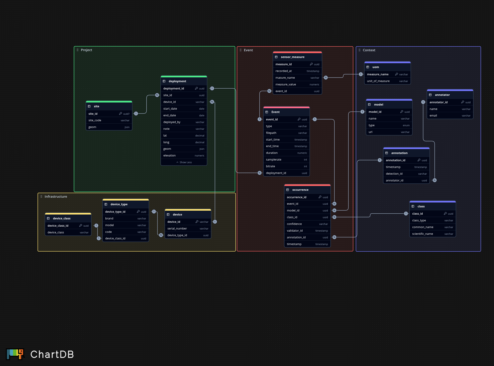

# sagebrush_software
Code associated with the SageBRUSH project.

There is an associated [sagebrush_hardware](https://github.com/conservationtechlab/sagebrush_hardware)
repository that contains relevant build information for SageBRUSH stations
that collect various data. This repo contains
SageBase set-up and schema information, as well as the processes
we use to parse and transfer those data streams into SageBase. 

## SageBase 

## LoRa pipeline

The LoRa pipeline folder contains an example workflow for setting up
Chirpstack, Node-Red, and PostgreSQL for storing data from a Dragino LHT65N temperature
and humidity sensor. It contains example docker-compose files for each of the 
applications to host, and how to connect the services to each other if they
are on different networks.

