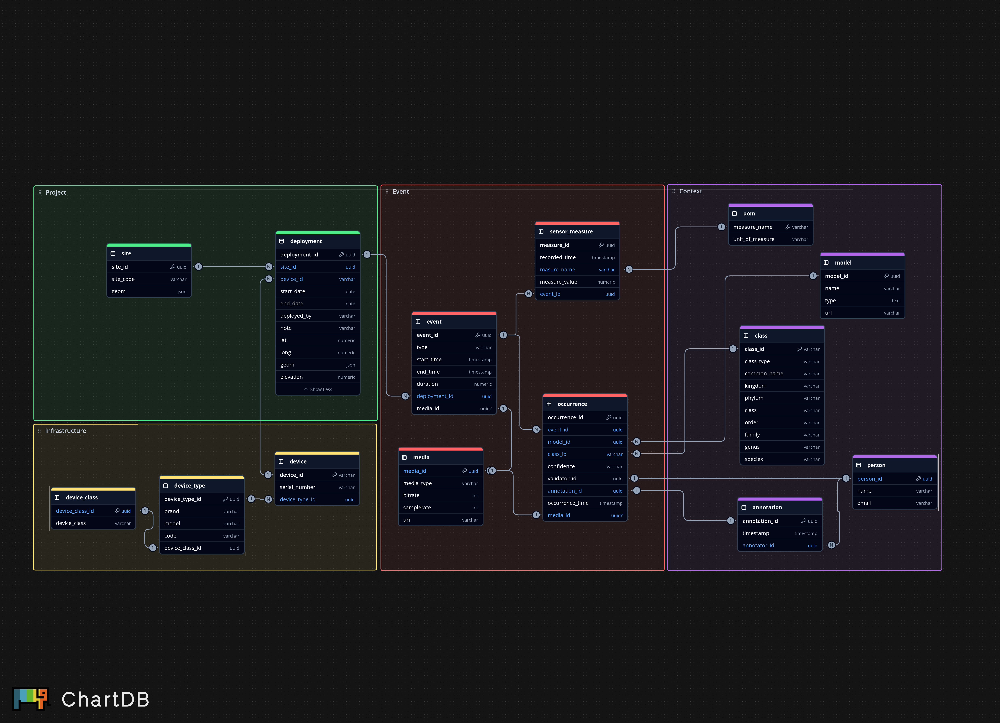

# sagebrush_software
Code associated with the SageBRUSH project.

There is an associated [sagebrush-cellulose](https://github.com/conservationtechlab/sagebrush-cellulose)
repository that contains relevant hardware build information for SageBRUSH stations
that collect various data. 

There is also an associated [sagebrush-canopy](https://github.com/conservationtechlab/sagebrush-canopy)
repository that contains relevant front-end builds for visualizing the various data
collected.

This repo contains SageBase set-up and schema information, as well as the processes
we use to parse and transfer those data streams into SageBase. 

## SageBase 

## LoRa pipeline

The LoRa pipeline folder contains an example workflow for setting up
Chirpstack, Node-Red, and PostgreSQL for storing data from a Dragino LHT65N temperature
and humidity sensor. It contains example docker-compose files for each of the 
applications to host, and how to connect the services to each other if they
are on different networks.

## TBMQ Broker

For receiving custom (non-LoRa) sensor data, currently SageMic data. By hosting the TBMQ (ThingsBoard MQTT) Broker as a Docker
 we can receive larger data packets from almost any type of networked device using cellular, satelite, P2P radio, Wifi... 
Node-Red sits as a subscriber, and the python paho-mqtt client library handles sending device data to TBMQ.
For added security, we configured TLS for communication to and from the Broker. Instructions for modifications to the Docker
 and basic instructions to configure TLS and configuring publisher/subscriber keys are in the mqtt broker folder
in this repository.

## Socket Handlers - Deprecated (Replaced by TBMQ adoption)

There are instructions for setting up persistent data transfer between servers that
manage IoT devices and the server where SageBase might be hosted. The current socket
example is for checking for newly created sound files on the remote IoT management server,
and using a secure tunnel to transfer that file in real time. This can be modified to
transfer other types of data. 

