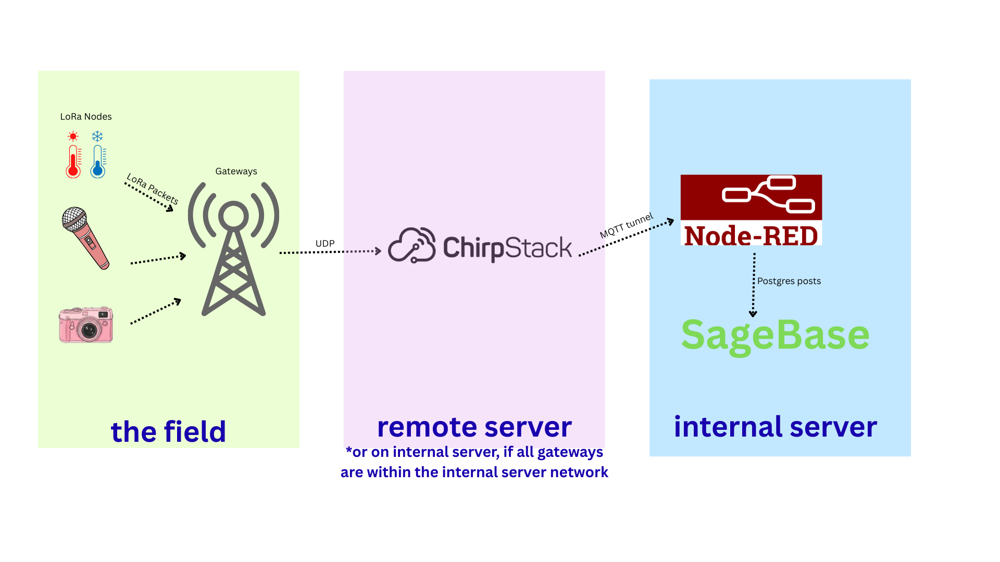

## So, you want your LoRa devices to post their data to your SageBase database and frontend. What now?


 
You will need:

	- A LoRa Server
	- Node-Red

Which LoRa server should you choose?
| Server | Cost | Set-up difficulty | Connectivity Constraints |
| --- | --- | --- | --- |
| Chirpstack | Free | Moderate | Needs to be run on a machine where port 1700 can be opened only IF cell gateways will be used |
|The Things Network | Limited Free, high cost to scale | Super Easy | Gateways need internet connectivity and downstream database also needs internet access |

## If Chirpstack- where should you host it?

*For TTN, this section can be ignored as the data will be accessible wherever
you have internet. 

For a local setup, Chirpstack can be run on any machine within your local network.
IE, if all your gateways have an ip address that is on the same subnet as your chirpstack server.

If you have any cell enabled gateways, or gateways connected to any internet
that is not within your chirpstack server network, you will need port 1700 open for ingress on the machine hosting chirpstack. 

If that is not possible on your local network for security reasons, host chirpstack on a remote machine where this
port opening is possible, such as a virtual machine. 
 
### Hosting Chirpstack
We choose to host Chirpstack via Docker on an ubuntu machine, instructions found here:
https://www.chirpstack.io/docs/getting-started/docker.html

As noted in the docs, the default region is EU 868. For USA, the region needs to be US 915. This amounts to changing
the docker-compose.yml file under chirpstack-gateway-bridge environment variables to the below:
```
    environment:
      - INTEGRATION__MQTT__EVENT_TOPIC_TEMPLATE=us915_0/gateway/{{ .GatewayID }}/event/{{ .EventType }}
      - INTEGRATION__MQTT__STATE_TOPIC_TEMPLATE=us915_0/gateway/{{ .GatewayID }}/state/{{ .StateType }}
      - INTEGRATION__MQTT__COMMAND_TOPIC_TEMPLATE=us915_0/gateway/{{ .GatewayID }}/command/#
```
#### Cell-enabled Gateways
If you have any cell enabled gateways, or gateways that live outside the local network that Chirpstack is hosted on, IE on
a Starlink wifi or elsewhere, you will need to open port 1700 for ingress. We use UDP for data transmission from the gateways, 
and Chirpstack will not see data from these gateways unless it can listen on that port without a firewall. 

#### Configuring the Gateways
We typically use RAK brand gateways, and their configuration page allows you to input the address of the LoRa server it should
forward data to. If hosted locally, merely input the IP address on the local network of the machine running chirpstack. If hosted
externally, you need the public static ip of the server.

*TTN has a string type of server name for data forwarding, and that can be found on your instance, this would go in place of
the ip address that chirpstack uses.

# Node-Red
Node-Red is the data handler for incoming LoRa data where you can decide where and how the payloads arrive at other
end points, and in our case, SageBase.
Again, we use Docker set-ups, here is the link to the basic Node-Red docker install: https://nodered.org/docs/getting-started/local#installing-with-docker

And there is an additional page with more parameters to customize the instance, we recommend ensuring you have a persistent
data volume storage mount to ensure the Node-Red data persists across reboots and restarts, the default is a test bed
that doesn't save your changes across restarts. https://nodered.org/docs/getting-started/docker

You can also add a username or password to increase security (found in the settings.js file within the nodered data directory,
as Node-Red will be available on the ip:1880 port of the machine its hosted on. Speaking of hosting...

You can use our node-red docker-compose file found here so that the future instructions are easier to follow.

## Where to host Node-Red
You can host Node-Red on the same machine that SageBase is located. This may or may not be where Chirpstack is hosted.

### Linking Chirpstack with Node-Red
Follow the instuctions here to install the chirpstack package into Node-Red, allowing for easy receiving and handling of uplink
payloads from devices: https://www.chirpstack.io/docs/guides/node-red-integration.html

You can use the example Node-Red json provided in this repo to get started with the flow that we use to grab temperature sensor
data from chirpstack (Dragino LHT65N), and post it to the database. You will need to make a few tweaks to work with your system, namely:

- MQTT Broker Node
- MQTT in node
- Device Switch Node

#### MQTT Broker Node
For the MQTT broker node, you mainly need to input the ip address of your Chirpstack MQTT broker. If they are on the same internal
network, it will just be the ip address of the machine its running on in that network. If not, you will need to follow the instructions
below to link the MQTT port from your chirpstack machine to the Node-Red machine. But for now, you can run the commands below to determine
what IP will go into the 'server' box in the connection tab of the mqtt-broker node in node-red
```
sudo docker network ls
```
You should see sage_net as a NAME, if you used our example docker compose for nodered. Copy the network ID
associated with that name for the following command:
```
sudo docker network inspect <NETWORK ID for sage_net> --format '{{(index .IPAM.Config 0).Gateway}}'
```
The IP address printed will be the ip address input into that chirpstack node.

#### MQTT in Node
For this node you should see the server you just set up as the MQTT broker node in the 'server' box. But the 
'Topic' box is what we'll change here, for grabbing ALL chirpstack events from all devices including the 
gateway statuses, you can use the topic:
```
application/+/device/+/event/+
```

*if using TTN, we use one topic per device rather than sharing one topic and differentiating between
devices later. The example flow for TTN is also provided, but the topics for TTN will look more like:
```
v3/<your application>@<your instance>/devices/<name of sensor>/up
```

#### Device Switch Node
In our example node-red flow, we put placeholders in the boxes, what will go here is the device EUI (from
Chirpstack) for each device you would like to grab data from. We also like to name the following
flows with the dev eui or other device identifyer to make the flows easier to read, but this is optional.

##### SSH tunnel from remote Chirpstack to local Node-Red
You will need to make a tunnel between your chirpstack mqtt and your node-red instance if they are on
different networks. One method is:
1) Put your public ssh key from your node-red machine onto your remote chirpstack machine.
2) Determine the ip that your chirpstack is running on, which may be different than the public ip you
use to ssh into. Run:
```
ip a
```
 
and look for something that's 10.x.x.x or 192.x.x.x or 172.x.x.x. Then from the local node-red machine:
 
```
autossh -N -f -L 0.0.0.0:1883:<internal ip of remote host>:1883 <user on remote host>:<public ip of remote host>
```
You can set up a systemd service to autoconnect on reboots.

## Setting up PostGres server

### Installing the postgres package into Node-Red
Package info found here:https://flows.nodered.org/node/node-red-contrib-postgresql


