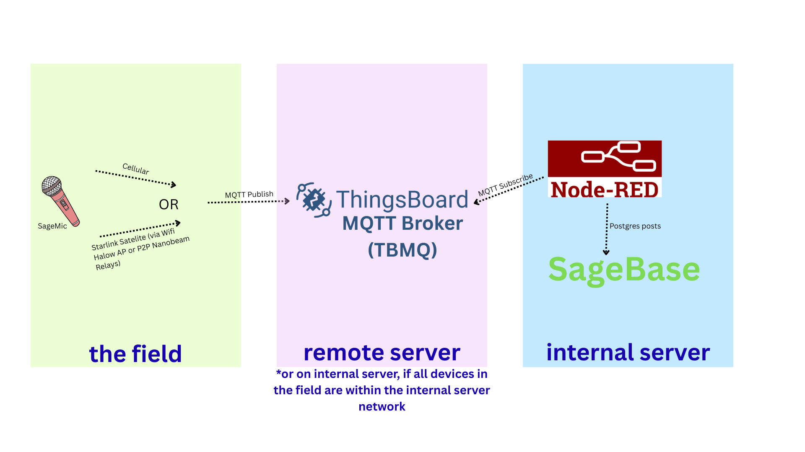
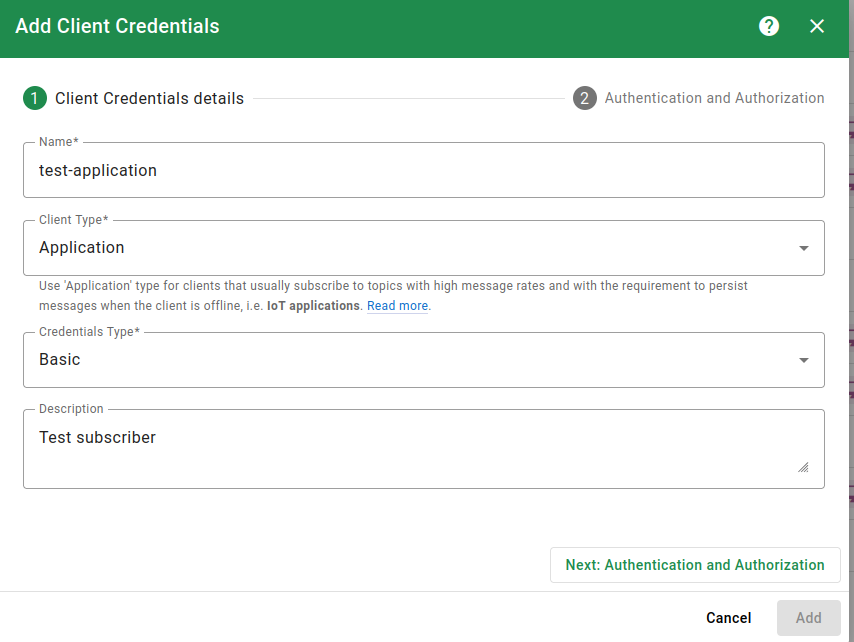
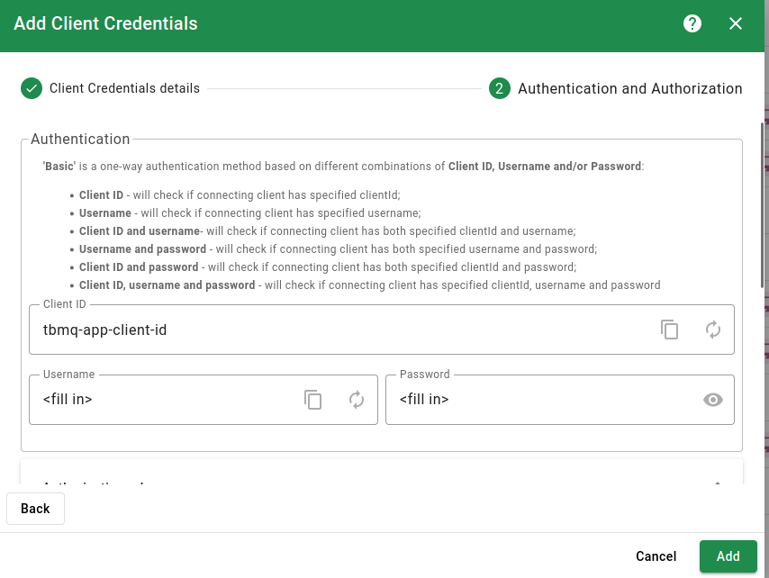
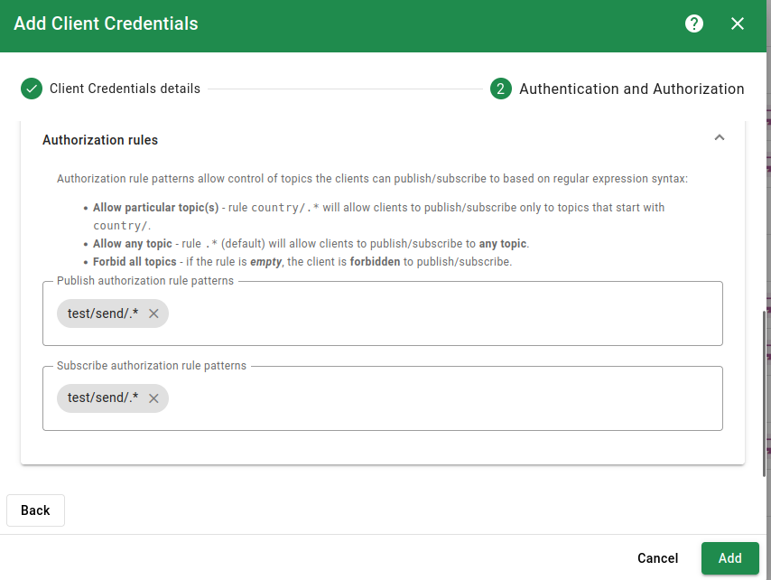
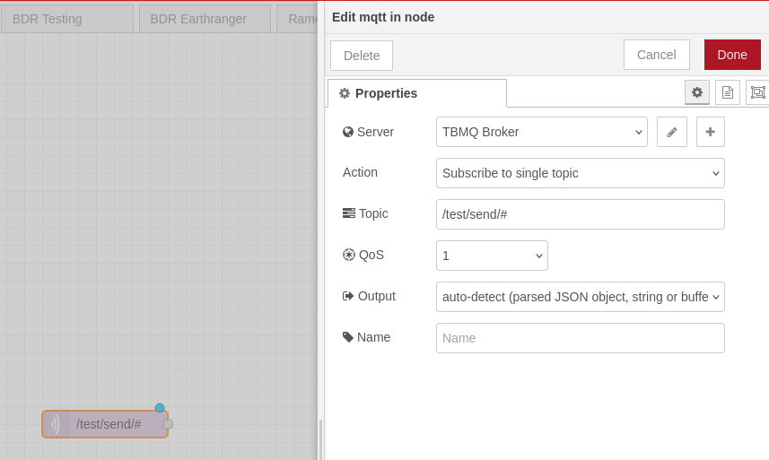
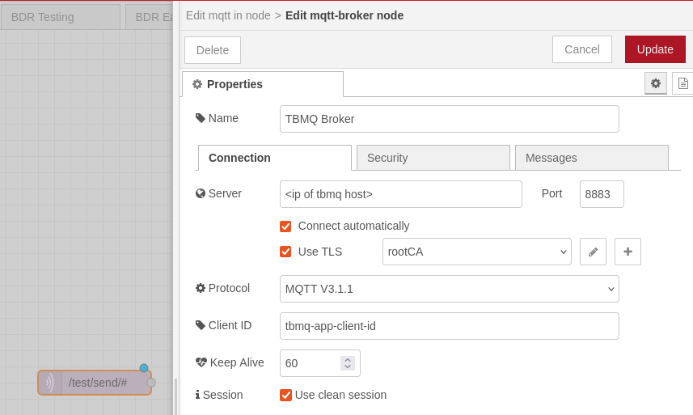
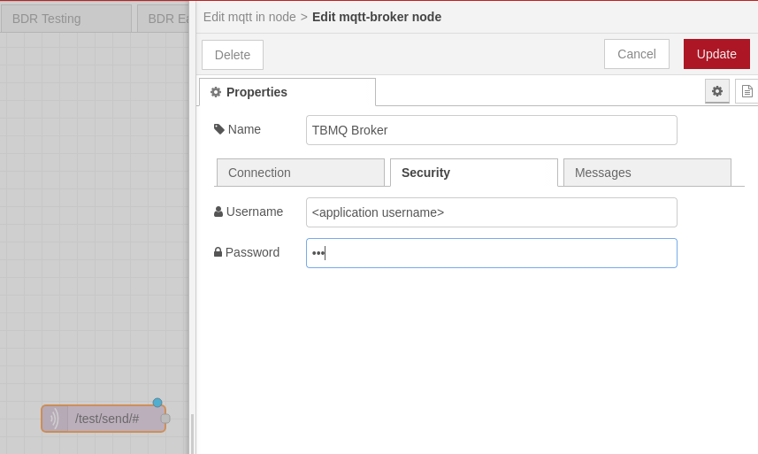
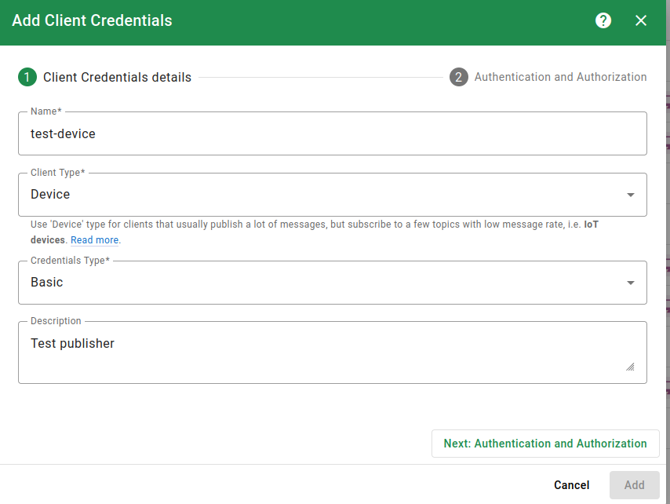

## So, you want your custom IoT (non-LoRa) devices to send their data to your database in real time, from anywhere in the field... what now?

We will host an MQTT Broker!



## Setting up your VM
We use an Ubuntu 26 image in a virtual machine, and only enable ingress from port 22 to start, ideally only from the IP you
will be SSHing in from. We will enable ingress and egress from port 8883 later, but for now just SSH access is needed.

# TBMQ (ThingsBoard MQTT Broker)
[TBMQ Setup Guide](https://thingsboard.io/docs/mqtt-broker/installation/docker/)

The setup guide provides a bash script to run which downloads the docker-compose.yml used to run TBMQ in a Docker container.
TBMQ recommends running the bash script each time you'd like to start the docker container even after changes are made, so make sure
to keep this bash script along with your docker-compose.yml.

In order to view the Broker in your laptop browser from the VM, ensure you port forward to 8080 on your
machine so you can access the UI from localhost:8080. 

```
ssh -L 8080:localhost:8080 user@host
```

Once set-up, you will be able to access tbmq securely in your browser at:

```
localhost:8080
```

### Enabling TLS
In order to create a private CA based server-auth setup and enable TLS from publishers and subscribers, you need to generate a self-signed certificate root. It's recommended to create
an intermediate key as well, but for the purpose of simplicity in this demo we will describe the making a root certificate,
and a server certificate. 

In the following instructions, make sure that your CNs are distinct.  

In a secure machine (not the virtual machine running TBMQ) create a root certificate:
```
openssl req -x509 -newkey rsa:4096 -sha256 -days 3650 -nodes -keyout rootCA.key -out rootCA.pem
```

Fill in the details as needed. You should have a rootCA.key and a rootCA.pem. The rootCA.key NEVER leaves the machine
or gets shared elsewhere. Best practice is to keep it air-gapped or on a piece of designated storage media.

Then create a private key for the TBMQ server:
```
openssl genrsa -out server.key 2048
```

Then create a certificate signing request from the server.key:
```
openssl req -new -key server.key -out server.csr
```

Fill in the details as needed. Password is optional, if you choose to use one you will need it in the TBMQ docker file later.
Then sign the certificate request with the rootCA, this WILL expire eventually so you need to set up a mechanism to rotate.

```
openssl x509 -req -in server.csr -CA rootCA.pem -CAkey rootCA.key -CAcreateserial -out server.crt -days 365 -sha256
Certificate request self-signature ok
```

Then put the server certificate and key into a singular .pem file. 

```
cat server.crt server.key > server.pem
```

Copy the server.pem and server.key into a folder in /home/user/certs into the TBMQ machine. 

Copy the rootCA.pem onto the end-device in a similar /certs folder, as well as onto the Node-Red machine. 

What we have created is a way to do one-way TLS, wherein the server gets authenticated by the publishers and subscribers, 
ensuring that they are transmitting encrypted data to the correct MQTT broker, the rootca is able to encode/decode the messages. 

### Further hardening
Best practices would be to NOT self-sign, and to obtain a rootCA from an actual certificate authority, it will also involve doing
two way TLS, which will remove the need for pub/sub usernames and passwords later. But one thing at a time!

## Modifying the docker-compose.yml

Once the example broker has been set-up, we need to add in our TLS settings and increase our max data rate in the docker-compose.yml

```
docker compose stop <container id>
```

In the compose file, add these lines to the 'tbmq' portion:

```
      SECURITY_MQTT_BASIC_ENABLED: "true"
      LISTENER_SSL_BIND_PORT: "8883"

      SSL_NETTY_MAX_PAYLOAD_SIZE: 600000
      TCP_NETTY_MAX_PAYLOAD_SIZE: 600000

      LISTENER_SSL_ENABLED: "true"
      LISTENER_SSL_CREDENTIALS_TYPE: "PEM"
      LISTENER_SSL_PEM_CERT: "/config/certificates/server.pem"
      LISTENER_SSL_PEM_KEY: "/config/certificates/server.key"
      LISTENER_SSL_PEM_KEY_PASSWORD: ""
```

In the "volumes:" tab under the tbmq portion, ensure that you are also mounting the "certs" folder we made with the server.key and server.pem so that tbmq docker can access them.

```
- /home/<user>/certs:/config/certificates
```

Also ensure that under the 'ports' portion of the tbmq lines have a mapping for 8883:8883

Re-run the tbmq-install-and-run bash script in the folder.

You may need to toggle the enable x.509 auth toggle in the main TBMQ UI once you re-navigate to the front-end. 
 
### Ports
Now that TLS is enabled on 8883, you can open that port within the Security Groups on the virtual host managing platform. 

# Pub/Sub
You will need Node-Red to be a subscriber and your device to be a publisher.

See SageMic repo for a feature test script that publishes a message using the ID, username, and password created below.

*IMPORTANT: TBMQ subscribers can only see publishes from the same PORT. Ie, if you send something, even to the same topic, over port 1883 and node-red is listening on 8883, it will not see it.
## Subscriber
Node-Red will be our subscriber. You need an MQTT in node, and you will need to configure the MQTT broker in node with our TBMQ information.

In TBMQ you will need to navigate to the 'Authentication' tab on the left. Click the + sign on the top right to add a new client credential.



Then define the client ID, username, password. This will be used in Node-Red later, so record the password because you will not be able to access it again from TBMQ!



Then define the topics that Node-Red will subscribe to. The provided image contains a test topic, if you change it, ensure that the publisher is sending a message that can still be received by this subscriber topic. 



In Node-Red, you will need to add an mqtt in node from the available nodes on the left. You will need to create a new MQTT broker. 





The Session ID will be the client ID from TBMQ, and ensure you upload the rootCA you added to this machine in a previous step and enable TLS. 

You will add the topic from TBMQ in the mqtt in node, and in the security tab in the mqtt broker node you will add the username and password from TBMQ for the subscriber client. 
Choose a quality of service of 1. 



Save and deploy, and you should see a green "connected" icon below the mqtt in node on the palette. Add a debug node so you can see the messages as they come in.

## Publisher
In TBMQ, creating a publisher is about the same as creating a subscriber, except you will choose "Device" instead of "Application" in the client credential. Choose the same topic as the subscriber
for this test.




You can use the command line and mosquitto-client to send a test publish that should be visible in NodeRed, but note the example cli command provided by TBMQ after you create
a publisher/subscriber will NOT work for how we set this up. If you would like to test from the command line (after successfully configuring nodered, you can use this command line
command to test from any machine, including within the tbmq server machine. Fill in the <> values with your own server, topic, path to certificate, client id, username, and password. 

You should see "Hello World" printed to the Node-Red debug set up earlier.

```
mosquitto_pub -d -q 1 -h <ip of tbmq server> -p 8883 --cafile /path/to/rootCA.pem -t "<topic>" -i "<client id>" -u "<username>" -P "<password>" -m 'Hello World' -V mqttv311
```

Note that we recommend you setup a [Sagemic](https://github.com/conservationtechlab/sagemic)
and use the feature test script to send instead as that will be what is used for a real deployment. 

*When testing TBMQ publishing and subscribing from different devices, generate a new TBMQ client each time. If you reuse client IDs in different places or at the same time in multiple spots, it could get weird.

# TBMQ (mTLS)
### Enabling mTLS (Two way TLS)
- Follow this set of instructions for mTLS (skip the previous enabling TLS)  
- In this section, work on your secure machine
- Make sure all common names (CN) are distinct from each other

**rootCA**

```
openssl req -x509 -newkey rsa:4096 -sha256 -days 3650 -nodes -keyout rootCA.key -out rootCA.pem
```
- This creates `rootCA.key` and `rootCA.pem`
- `rootCA.key` should never leave the machine 

**TBMQ Certificates**

```
openssl genrsa -out server.key 2048
openssl req -new -key server.key -out server.csr
```
- This creates your server key and csr

```
openssl x509 -req -in server.csr \
  -CA rootCA.pem -CAkey rootCA.key -CAcreateserial \
  -out server.crt -days 365 -sha256 \
  -extfile <(printf "subjectAltName=DNS:<server-CN>,IP:<broker-ip>")
```
- mTLS has strict (inbound) host verification. If we didn't do sAN, it will compare the CN name and ip address and think they don't match
- fill in the CN you gave your server in the csr process, and the ip of your broker
- this will sign your server certificate!

```
cp server.crt server.pem
cat rootCA.pem >> server.pem 
```
- This allows us to build the TrustStore, which is needed by mTLS

Move `server.pem` and `server.key` into `/home/user/certs` on the TBMQ machine  

**Client certificates**

This will basically be the same as that of server, but no need for sAN because it's outbound!
Do this for both NodeRed and end-device!

```
openssl genrsa -out client.key 2048
openssl req -new -key client.key -out client.csr
openssl x509 -req -in client.csr -CA rootCA.pem -CAkey rootCA.key -CAcreateserial -out client.crt -days 365 -sha256
```

Move `rootCA.pem`, `client.crt`, `client.key` into your end-device/NodeRed

### TBMQ Machine Configuration
Once the example broker has been set-up, we need to add in our TLS settings and increase our max data rate in the docker-compose.yml

```
docker compose down
```

In the compose file, add these lines to the 'tbmq' portion:

```
      SECURITY_MQTT_BASIC_ENABLED: "true"
      LISTENER_SSL_BIND_PORT: "8883"

      SSL_NETTY_MAX_PAYLOAD_SIZE: 600000
      TCP_NETTY_MAX_PAYLOAD_SIZE: 600000

      LISTENER_SSL_ENABLED: "true"
      LISTENER_SSL_CREDENTIALS_TYPE: "PEM"
      LISTENER_SSL_PEM_CERT: "/config/certificates/server.pem"
      LISTENER_SSL_PEM_KEY: "/config/certificates/server.key"
      LISTENER_SSL_PEM_KEY_PASSWORD: ""
```
In the "volumes:" tab under the tbmq portion, ensure that you are also mounting the "certs" folder we made with the server.key and server.pem so that tbmq doc>

```
- /home/<user>/certs:/config/certificates
```

Also ensure that under the 'ports' portion of the tbmq lines have a mapping for 8883:8883

```
docker compose up -d
```

Give your docker container permission to read server certificates 
```
sudo chmod 644 server.pem
sudo chmod 644 server.key
```

### TBMQ UI Configuration
Add credientials for both NodeRed and end-device  

Authentication -> Credentials
- Name: anything
- Client Type: Application for Nodered, Device for end-device
- Credentials Type: X.509 Certificate Chain
- Certificate Common Name: The exact one you gave it when you created .csr
- Everything else blank
Authentication -> Providers
- Toggle X.509 Certificate Chain to Active

### NodeRed Configuration
For your mqtt broker node:
- Name: anything
Connection
- Server: ip address of your broker, port 8883
- connect automatically, use TLS (add TLS config)
- Protocol: MQTT V3.1.1
TLS Config
- You can either use key/certs from local files or upload
- Upload your `nodered.key`, `nodered.crt`, `rootCA.pem`

Leave the rest as is and click update and deploy. 

### Debugging
If the connection cannot be established for some reason, run the following on your end-device:
```
openssl s_client -connect <broker-ip>:8883 -CAfile <ca file name>
```
- Check if the CNs of the server and rootCA is the same as what you put
- Check the return code at the very bottom

If the CNs do not match what you put, it is likely that the Docker is holding on to cached copies of old certificates. To remove them: 
```
docker compose down -v
docker container prune -f
sudo chmod 644 server.pem
sudo chmod 644 server.key
docker compose up -d
```
